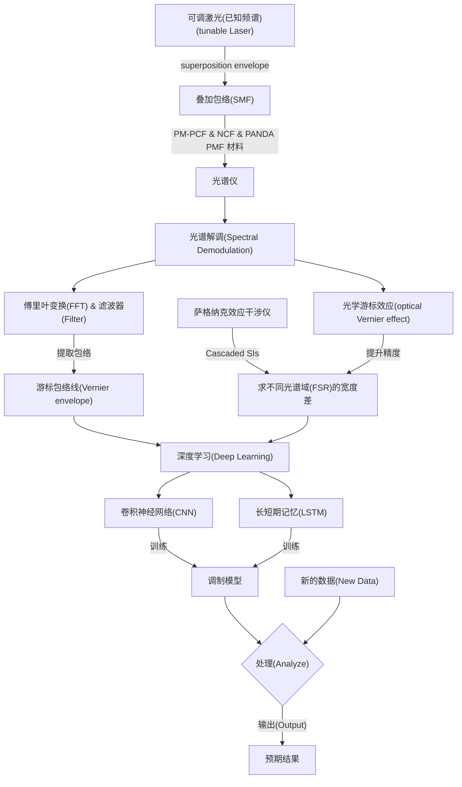

# Spectro Analyzer

Refer from Deep_Learning_Improved_Spectral_Demodulation_of_Interferometry_Vernier_Effect_for_Pressure_Sensing.pdf

[torch.nn — PyTorch 2.9 documentation](https://docs.pytorch.org/docs/stable/nn.html#convolution-layers)

## 大致流程



---

## 应用原理[]

### 游标效应&叠加包络

叠加包络的实现形式围绕 “多信号叠加 + 包络提取” 展开，主要分为硬件实现和软件实现两大类，具体形式需结合应用场景选择。

#### 一、硬件实现形式(不太清楚SMF是怎么工作的)

- 模拟电路叠加 + 包络检波：通过加法器电路直接叠加多路模拟信号，再用二极管、电容、电阻组成的检波电路提取叠加后的包络。
- 射频 / 中频模块集成：在通信设备中，通过混频器、功率合成器叠加信号，搭配专用包络检测芯片（如 AD8361）快速输出包络。

#### 二、软件实现形式

- 时域直接叠加 + 包络计算：先将多路信号在时域上逐点相加，再通过 “峰值检测 + 低通滤波” 提取包络（适用于低速信号）。
- 频域叠加 + 逆傅里叶变换：将各信号转换到频域叠加，逆变换回时域后再提取包络（适用于复杂频谱信号）。[这个论文中用到的]
- 数字滤波辅助实现：叠加前对各信号进行滤波预处理，叠加后用滑动窗口法或希尔伯特变换精准提取包络（适用于高精度场景）。

---

### 深度学习

CONFIGURATION OF NEURAL NETWORK MODELS FOR SPECTRAL DEMODULATION

#### 必须注意的事项

以下所有的神经网络(LSTM, CNN, CNN+LSTM)，最后他们自己吐出的值**是***<u>特征值</u>*
不过特征值是唯一的，需要后期与已知压力值进行关联

#### 框架设定

论文中使用 python 环境，这里也依旧使用python环境
我将会使用 torch 分别实现 LSTM 与 CNN

#### 数据需求

##### FSR_envelope 自由光谱范围的包络线点集数据

计算公式：
FSR_envelope = FSR_sen · FSR_ref / |FSR_sen - FSR_ref|

说明：
FSR_sen 指 FSR_sensing，测量的光谱
FSR_ref 指 FSR_reference，基准光谱，一般是在 0MPa 时测量的光谱

数据类型(Type)：
虽然论文中光谱曲线数据是一维(1D)的
但现在先用二维(2D)来存储源数据RawData
再通过函数格式化成一维数据，输入至LSTM或CNN层
采用508个数据点(508x1)
元组数组 [(x0, y0), (x1, y1), (x2, y2), ..., (x_n, y_n)]
或者更灵活的 对象数组

```python
class FSR_Point():
    point = [0, 0] # 二维点数据
    isWrong = False # 是否为错误点
    otherArg = None # 其他参数
    def Reset(self):
        self.pointArr = [0, 0]
        self.isWrong = False
    def Set(self, x, y):
        self.pointArr = [x, y]

class FSR_Arr():
    arr = [] # 存储
    length = 0 # 长度
    otherArg = None # 其他参数
    def __init__(self):
        for _ in range(512):
            self.arr.append(FSR_Point())
        length = 512
    def Reset(self):
        for i in self.arr:
            i.Reset()
        length = 512
    def FormatCSV(self, CSV_Path): # 从CSV文件中获取信息
        open ""
        pass
    def SetPoint(self, index, FSRpoint):
        if (self.length <= index):
            for i in range(index - self.length + 1):
                self.arr.append(FSR_Point())
        self.length = index + 1
        self.arr[index] = FSRpoint
```

然而源数据格式原文并未给出，暂时使用torch.randn(x, 508, 1)
关于torch.randn(x, 508, 1)后面我会解释

---

#### 基于LSTM的解调模型

reference:[LSTM架构详解 - 知乎](https://zhuanlan.zhihu.com/p/337700483)

torch.nn.LSTM 实现 LSTM

使用4层LSTM模型(four-LSTM-layer model):
翻阅Github上众多的写法得出

```python
# 定义LSTM网络
class LSTMNet(nn.Module):
    def __init__(self,
                 input_size=1,
                 hidden_size1=64,
                 hidden_size2=64,
                 hidden_size3=32,
                 hidden_size4=4,
                 seq_size=508,  # 假设序列长度为508，这其实是原文的输入长度
                 output_size=1):
        super(LSTMNet, self).__init__()
        self.lstm1 = nn.LSTM(input_size, hidden_size1, batch_first=True)
        self.lstm2 = nn.LSTM(hidden_size1, hidden_size2, batch_first=True)
        self.lstm3 = nn.LSTM(hidden_size2, hidden_size3, batch_first=True)
        self.lstm4 = nn.LSTM(hidden_size3, hidden_size4, batch_first=True)
        self.flatten = nn.Flatten() # 等价为nn.Flatten(start_dim=1，end_dim=-1)
        self.fc = nn.Linear(seq_size * hidden_size4, output_size)

    # nn.Module要求必须实现forward方法
    def forward(self, x):
        out, _ = self.lstm1(x)
        out, _ = self.lstm2(out)
        out, _ = self.lstm3(out)
        out, _ = self.lstm4(out)

        # 使用nn.Flatten替代view
        # 展平为(batch_size, 508*4) = (batch_size, 2032)
        # 扁平化很重要，之前漏了这个，被一些错误卡了许久
        # out = out.view(out.size(0), -1)  # 扁平化
        out = self.flatten(out)

        # 扁平化后的全连接，这个out就是这些输入曲线的特征值
        out = self.fc(out)
        return out
```

完整代码在 Launch.py 与 LstmNetTest.py 中都有描述

---

光谱的特征是一维曲线，可将其视为 508 个数据点，且向量维度为 1。具体而言，直接将 508×1 维度的输入数据 (记作(508, 1)) 传入第一个 LSTM 层，

这些数据输入形状 (2, 508, 1) 可以拆解为：

第 1 维 2: 2 个样本 (2 条不同的光谱，关于这个光谱原文并没有具体提及，这个“2”的用意放在周五详细解释）；

第 2 维 508: 每个样本包含 508 个数据点 (序列长度，对应原文“这视作一种序列数据”）；

第 3 维 1: 每个数据点的维度 (1 维）。

第一个 LSTM 层包含 508 个记忆单元，每个记忆单元会将初始的 1 维向量编码为 64 维向量，最终得到 508×64 维度的输出数据(508, 64)。

我暂时没有办法用自己的话清楚的解释LSTM是如何升维的，所以我用豆包AI帮我描述了这个过程

### 核心结论

每个 LSTM 记忆单元接收 1 维原始数据点，通过内部的门控机制（输入门、遗忘门、输出门）和计算，输出包含更多特征信息的 64 维向量，实现从 “原始数据” 到 “高维特征” 的转换。

### 关键理解点

1. 1 维向量是 “原始输入”，仅包含单个数据点的基础数值（比如光谱中某个波长对应的强度值）。
2. 64 维向量是 “编码后的特征”，不是简单增加数据量，而是通过 LSTM 的非线性变换，融入了该数据点的特征模式、与前后数据点的关联等信息。
3. 维度提升的目的是让数据携带更丰富的语义，方便后续网络层捕捉复杂规律（比如光谱中的特征峰、趋势变化等）。

### 通俗类比

可以把 1 维向量看作 “单个单词”，64 维向量就是 “包含这个单词的语境、情感、关联含义的完整短语”—— 既保留了原始单词的核心信息，又补充了更多相关特征，让网络能更全面地理解数据。当然这还只是第一层LSTM。

---

#### 基于CNN的解调模型

reference:[PyTorch 卷积神经网络 | 菜鸟教程](https://www.runoob.com/pytorch/pytorch-cnn.html)

注意：CNN返回的只是光谱曲线的特征值，不是压力值

##### 构建

有六个卷积区块

每个卷积区块包含以下部分：

[卷积层(convolution layer)
--原文中的filter指的是conv layer的kernel卷积核--
--卷积步幅(原文指moving step)stride=1--

批归一层(batch normalization layer)

激活函数(+ReLU)

池化层(max-pooling layer)]

每个卷积区块依次排列

维度形状变化：

siz (  B,   L,   C)
inp (  2, 508,   1)
--> (  2, 254,  16)
--> (  2, 127,  32)
--> (  2,  64,  32)
--> (  2,  32,  64)
--> (  2,  16,  64)
--> (  2,   8,  64)
out

B: 输入多少组，据实际情况而定;
L: 每次由池化层减半;
C: 交给卷积层增加通道

###### 输入

仍然是(508, 1)尺寸的数据，与LSTM一致

###### 处理层layer

有六个卷积区块
每个卷积区块包含以下部分：
[卷积层(convolution layer): nn.Conv1d
批归一层(batch normalization layer): nn.BatchNorm1d
激活函数(+ReLU): nn.ReLU
池化层(max-pooling layer)]: nn.MaxPool1d
每个卷积区块依次排列

##### 关于nn.Conv1d类

###### 知识迁移&对照

对于原文中出现的16个filter，其意思是将数据投影成16个通道(channels)。具体对应就是卷积层的参数配置：out_channels=16，这样就等同于16个filter。但也因此，卷积层的数据尺寸是有所不同的。

这里不能像LSTM一样直接把形状为[2, 508, 1]的数据直接给予CNN卷积层来处理，因为卷积层的处理形状与LSTM有所区别，下面是参数的对应关系以及差异：

| 参数     | LSTM                                 | Conv1d                                |
|:------:|:------------------------------------:|:-------------------------------------:|
| 输入维度   | input_size                           | in_channels                           |
| 输出维度   | hidden_size                          | out_channels                          |
| 输入数据尺寸 | (batch_size, seq_length, input_size) | (batch_size, in_channels, seq_length) |

在input_size与in_channels等同的情况下，不难发现LSTM与Conv1d的seq_length的位置刚好在对方in_channels或input_size的位置上

搞清楚这点接下来就是对数据进行<u>**转置**处理</u>，即可实现LSTM与Conv1d之间得数据传递

###### 输入数据处理

对数据进行如下操作：(在"CnnTest.py"源代码中有对这里更详细的解释)

```python
# 输入1通道，输出16通道，卷积核为5，步幅为1，填充数量(分别对应下列五个参数)
model = nn.Conv1d(1, 16, 5, stride=1, padding=1)
# 输入的数据尺寸(batch_size, seq_length=508, input_size=1)
x = torch.randn(batch_size=2, 508, 1)
# 所以先转置，替换序列为1，2的维度
x = x.permute(0, 2, 1)  # (batch_size, 1, 508)
# 这时，卷积层就能正常接收输入的数据
out = model(x)
print(out.shape)
# 预期输出 >>> tensor.size(2, 16, 508)
```

函数\<tensor>.permute()就是转置函数，这个函数使用灵活，可以将任意维度经行替换或重排序。这可以对应numpy中\<matrix>.transpose()函数。

###### 输出数据

从卷积层输出的数据，其形状为(2, 16, 508)
也就是原文说的(508, 16)

##### 单个CNN的类脚本

```python
class SingleCnn(nn.Module):
    # 这两个channels参数会有变动
    def __init__(self, in_channels=1, out_channels=16):
        super(SingleCnn, self).__init__()
        self.conv1d = nn.Conv1d(
            in_channels, # 输入通道(输入维度)
            out_channels, # 输出通道(输出维度)
            kernel_size=5, # 卷积核大小，原文为5
            stride=1, # 步幅，走一步处理一次
            padding=2 # 填充数量，卷积核为5，在input数据两侧各添加2个"0，使得输出长度仍为508
            )
        self.batchNormal = nn.BatchNorm1d(out_channels)
        self.relu = nn.ReLU()
        self.maxPool = nn.MaxPool1d(
            kernel_size=2, # 核大小
            stride=2 # 步幅
            # 这样设计可以实现原文中(508,16)向(254,16)的池化变换
            # 在后续的池化变换中，(B, L, C)中的C维度大小都除以二
            # 因此，nn.MaxPool1d的参数无需改变
        )

    def forward(self, x):
        # 输入x形状: (batch_size, 508, 1)
        # 卷积层需要 (batch_size, in_channels, seq_len)，所以先转置
        # 把x的位置序列调整为(0, 2, 1)，就是把后面两个换位
        # out = x.permute(0, 2, 1)  # (batch_size, 1, 508)
        # 单个CNN网络就不做转置
        # 最开始的输入转置交给 CnnDem (CNN集和解调器)

        # 卷积层输出: (batch_size, 16, 508)
        out = self.conv1d(x)

        # 传回LSTM需要的数据形状: (batch_size, 508, 16)
        # out = out.permute(0, 2, 1)
        # 不过，这个测试文件专属于CNN，不需要转置成LSTM的格式

        # 批归一化层需要的数据形状与卷积层输出的相同
        # 无需转置
        out = self.batchNormal(out)
        out = self.relu(out)

        # 池化层
        # 无需转置
        out = self.maxPool(out)

        return out
```

##### CnnDem(CNN集合解调器)的类脚本

```python
## CNN集合(CNN解调器)
class CnnDem(nn.Module):
    def __init__(
            self, 
            in_ch = 1, 
            out_ch1 = 16, 
            out_ch2 = 32, 
            out_ch3 = 32, 
            out_ch4 = 64, 
            out_ch5 = 64, 
            out_ch6 = 64, 
            ):
        super(CnnDem, self).__init__()
        # 卷积网络组
        self.CNNs = [
            SingleCnn(in_ch, out_ch1), 
            SingleCnn(out_ch1, out_ch2), 
            SingleCnn(out_ch2, out_ch3, pool_padding=1), # 127 --> 64(not 63)
            SingleCnn(out_ch3, out_ch4), 
            SingleCnn(out_ch4, out_ch5), 
            SingleCnn(out_ch5, out_ch6)
        ]
        # 扁平层
        self.flatten = nn.Flatten(start_dim=1, end_dim=-1)
        # 全链接层
        self.fc = nn.Linear(out_ch6 * 8, 1)
    def forward(self, x):
        # 对输入的数据转置
        out = x.permute(0, 2, 1)

        for cnn in self.CNNs:
            # 直觉告诉我会有一些问题发生
            out = cnn(out)
            # 观察一下CNN输出的数据形状
            # print(out.shape)

        """
        第一次输出：
        >>> ...
        >>> torch.Size([2, 32, 127])
        >>> torch.Size([2, 32, 63])
        >>> ...
        在输出数据的序列L维度为奇数时
        下一次池化层需要设置peding=1
        --1.这个可以写成自动判定
        --2.也可以就这个项目进行有限的设置
        ----这里选择2有限的设置
        ----这个padding设置加在第2个CNN上
        预期输出：
        >>> ...
        >>> torch.Size([2, 32, 127])
        >>> torch.Size([2, 32, 64])
        >>> ...
        >>> torch.Size([2, 64, 8])
        新增padding参数后达到与其输出
        """
        out = self.flatten(out)
        out = self.fc(out)

        # 注意：这个 out 不是压力值，而是特征值，真正的压力值需要配置回归模型
        return out
```

完整代码位于"CnnTest.py"

---

#### CNN + LSTM 模型

结合以上的构建经历，这步就会轻松许多

在之前CnnDem的基础上：继承CnnDem类并重写__init__和forward方法

添加两个LSTM层

LSTM1层的输入大小为CnnDem的输出通道数：out_ch6 = 64

LSTM2层的输入大小为LSTM1的隐藏层大小：lstm_hidden_size = 16

输出大小为1

注意：这里的LSTM层是为了提取时间序列特征

因此LSTM的输入数据格式为(batch, seq_len, feature_size)

而CnnDem的输出数据格式为(batch, feature_size, seq_len)

需要转置

##### 代码

如下：

```python
class CnnLstmDem(CnnDem):
    def __init__(self,
            in_ch = 1, 
            out_ch1 = 16, 
            out_ch2 = 32, 
            out_ch3 = 32, 
            out_ch4 = 64, 
            out_ch5 = 64, 
            out_ch6 = 64,
            lstm_hidden_size1=16,
            lstm_hidden_size2=1
            ):
        super(CnnLstmDem, self).__init__(
            in_ch, out_ch1, out_ch2, out_ch3, out_ch4, out_ch5, out_ch6
        )
        # LSTM层
        self.lstm1 = nn.LSTM(
            input_size=out_ch6,
            hidden_size=lstm_hidden_size1,
            batch_first=True
        )
        self.lstm2 = nn.LSTM(
            input_size=lstm_hidden_size1,
            hidden_size=lstm_hidden_size2,
            batch_first=True
        )
        # 修改全连接层的输入大小
        self.fc = nn.Linear(lstm_hidden_size2, 1)

    def forward(self, x): # 重写forward方法
        out = x.permute(0, 2, 1) # 转置为CNN需要的格式
        for cnn in self.CNNs:
            out = cnn(out)
        out = out.permute(0, 2, 1) # 转置为LSTM需要的格式
        out, _ = self.lstm1(out)
        print(out.shape)
        out, _ = self.lstm2(out)
        print(out.shape)
        # out = out[:, -1, :] # 取最后一个时间步的输出
        out = self.fc(out)
        return out
```

---

#### 训练Epoch

一步一个脚印，每一步计算一次损失(Loss)，使直接近0  

(Coming Soon)

---


(Coming Soon)

Steve
